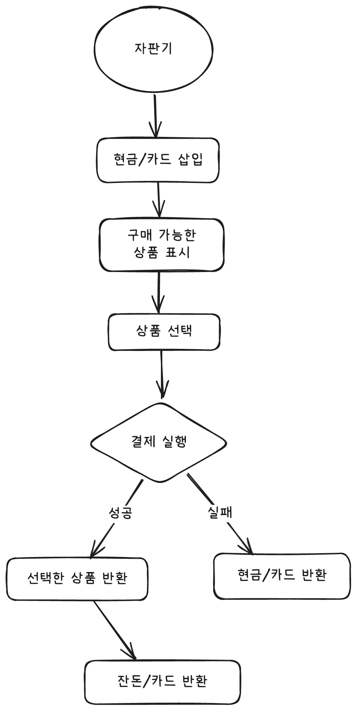

# Vending Machine

React + TypeScript + Vite 기반의 자판기 동작 시뮬레이션 프로젝트입니다.  
사용자가 현금 또는 카드로 결제하여 원하는 음료수를 구매할 수 있습니다.



## 🚀 실행 방법

### 1. 환경 준비

- **Node.js**: v20.x 이상
- **npm**: v10.x 이상

### 2. 프로젝트 설치

```bash
npm install
```

### 3. 프로젝트 실행

```bash
npm run dev
```
